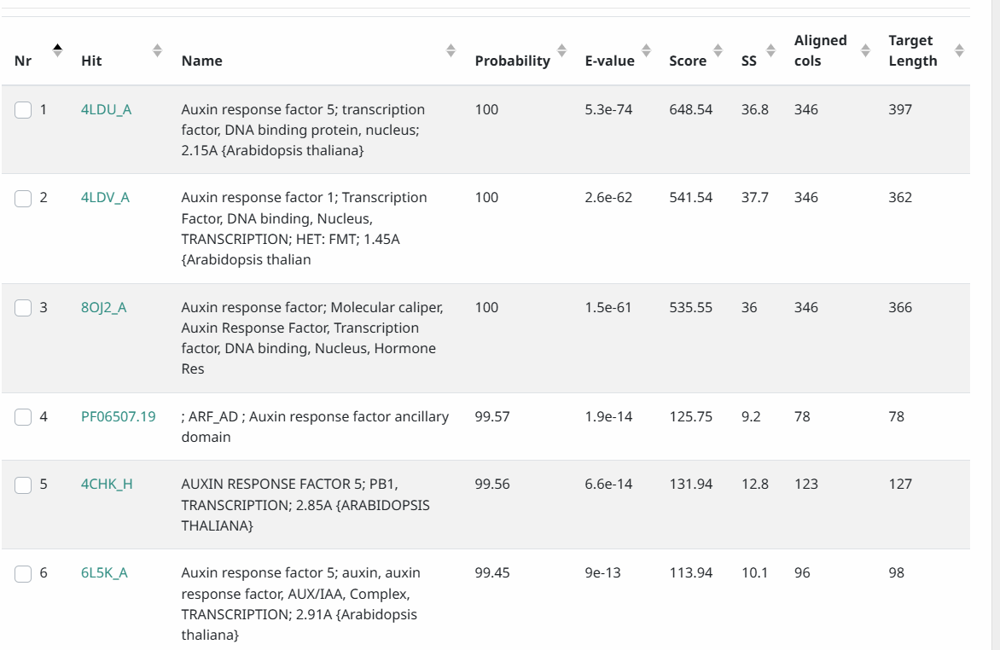
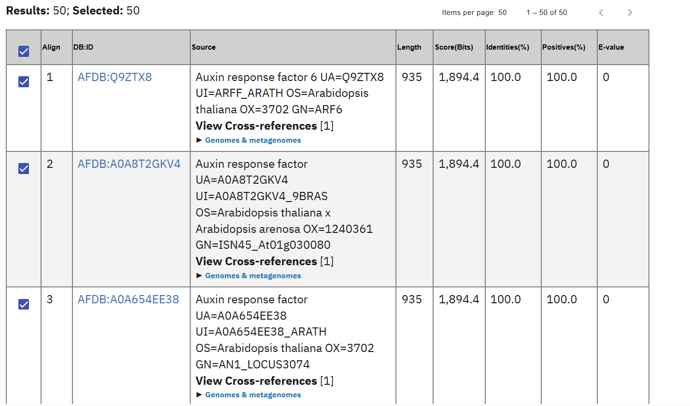

# Session 1_Annotation of coding sequences

<details>
<summary><strong>🔴 Exercise 1</strong></summary> 
 
## Question  

**How many sequences have been formatted 
and how does this affect the E-value of BLAST searches?**

## Objective

The aim of this exercise was to prepare a protein sequence collection  
for BLAST searches.

In addition, the objective was to understand how the size of the database  
influences the statistical significance of BLAST results,  
with particular emphasis on the E-value.

## Commands used  

```bash
(base) mehmetsonmez@MEMO:~$ docker start -ai bioinfo_iamz

vep@5dc71ff4216c:/home/vep$ cd /home/vep/test_data

vep@5dc71ff4216c:/home/vep/test_data$ ls

vep@5dc71ff4216c:/home/vep/test_data$ cp uniprot_Atha.fasta.gz /data/

vep@5dc71ff4216c:/home/vep/test_data$ cd /data

vep@5dc71ff4216c:/data$ ls

vep@5dc71ff4216c:/data$ gunzip uniprot_Atha.fasta.gz

vep@5dc71ff4216c:/data$ ls

vep@5dc71ff4216c:/data$ /home/vep/get_homologues/bin/ncbi-blast-2.16.0+/bin/makeblastdb \
-dbtype prot \
-in uniprot_Atha.fasta

```

## Results

The database formatting process produced the following output:

Adding sequences from FASTA; added **15719 sequences in 0.166255 seconds**.

This indicates that a total of 15,719 protein sequences from 
Arabidopsis thaliana were successfully included in the BLAST database.


## Interpretation and discussion

The E-value in BLAST describes the number of alignments with a given 
score that are expected to occur by chance when searching a database 
of a specific size. Therefore, the E-value is directly dependent on 
the size of the database.

In this exercise, formatting a database containing 15,719 protein 
sequences means that BLAST searches are performed against a relatively
large search space. As a consequence, for a given alignment score, 
the E-value will be higher than it would be in a smaller database. 
This is because the probability of finding random matches increases 
as the number of sequences in the database increases.

Thus, when interpreting BLAST results, it is essential to consider 
database size: a low E-value in a large database provides stronger
evidence of biological relevance than the same score obtained from a 
small database.

## References

BLAST Help Manual – E-value definition
https://blast.ncbi.nlm.nih.gov/doc/blast-help/FAQ.html

OpenAI ChatGPT – used for language refinement and conceptual 
clarification of BLAST E-value interpretation
Prompt-based assistance during Session 1, Exercise 1

</details>

<details>
<summary><strong>🔴 Exercise 2</strong></summary>

## Question  

**Can you redirect the output of `blastp` and `blastx`  
to separate files called `test.faa.blast` and `test.fna.blast`?**

## Objective  

The objective of this exercise was to query the UniProt protein collection  
using a sample coding sequence (ARF6) and its corresponding transcript.

In addition, the aim was to learn how to redirect BLAST search outputs  
from the standard output to separate result files for further analysis.

## Commands used  

```bash
(base) mehmetsonmez@MEMO:~$ docker start -ai bioinfo_iamz

vep@5dc71ff4216c:/home/vep$ cd /home/vep/test_data

vep@5dc71ff4216c:/home/vep/test_data$ cp test.faa /data/

vep@5dc71ff4216c:/home/vep/test_data$ cp test.fna /data/

vep@5dc71ff4216c:/home/vep/test_data$ cd /data

vep@5dc71ff4216c:/data$ /home/vep/get_homologues/bin/ncbi-blast-2.16.0+/bin/blastp \
-db uniprot_Atha.fasta \
-query test.faa \
-outfmt 6 \
> test.faa.blast

vep@5dc71ff4216c:/data$ /home/vep/get_homologues/bin/ncbi-blast-2.16.0+/bin/blastx \
-db uniprot_Atha.fasta \
-query test.fna \
-outfmt 6 \
> test.fna.blast

vep@5dc71ff4216c:/data$ ls
```
## Results  

Two separate BLAST output files were successfully generated:

- `test.faa.blast`, containing the results of the protein–protein BLAST search (`blastp`)
- `test.fna.blast`, containing the results of the transcript–protein BLAST search (`blastx`)

Both files are in tab-delimited format (`outfmt 6`), which is suitable  
for downstream filtering and analysis.

## Interpretation and discussion  

The redirection operator (`>`) allows BLAST results to be written directly  
to files instead of being printed to the terminal.

This approach is essential when working with large BLAST outputs,  
as it enables reproducible analyses, result storage, and further processing  
without losing information displayed on the screen.

Using separate output files for `blastp` and `blastx` ensures that  
protein-based and transcript-based searches are clearly distinguished.

## Difficulties encountered  

The BLAST executables were not available in the default system PATH  
inside the Docker container. Therefore, the full path to the BLAST binaries  
had to be used in order to execute the commands successfully.

## References  

BLAST Help Manual  
https://blast.ncbi.nlm.nih.gov/doc/blast-help/FAQ.html

OpenAI ChatGPT – used for language refinement and clarification  
of BLAST output redirection during Session 1, Exercise 2

</details>

<details>
<summary><strong>🔴 Exercise 3</strong></summary>

## Question

**What is the default alignment format, and can you show an example?**

## Objective

The objective of this exercise was to identify the default output format  
used by BLAST when no output format is explicitly specified.

In addition, the aim was to understand how alignment information  
is presented in this default format and to recognize its main components  
through a real BLAST result example.

## Commands used

```bash
vep@5dc71ff4216c:/data$ /home/vep/get_homologues/bin/ncbi-blast-2.16.0+/bin/blastp \
-db uniprot_Atha.fasta \
-query test.faa
```
## Results

Running the BLAST command without specifying the `-outfmt` option  
produced a pairwise alignment output.

**An excerpt of the default BLAST alignment output** is shown below:

```text
>sp|Q9XIK5|Y1045_ARATH B3 domain-containing protein At1g10455
OS=Arabidopsis thaliana OX=3702 GN=At1g10455 PE=2 SV=1
Length=152

 Score = 28.1 bits (61),  Expect = 9.7
 Identities = 21/92 (23%), Positives = 40/92 (43%), Gaps = 4/92 (4%)

Query  131  KTLTASDTSTHGGFSVPRRAAEK-VFPPLDYS---QQPPAQELMARDLHDNEWKFRHIFR  186
            K L+ SD        +P++  E  V P +D+    +     E+  RD+   +  +    +
Sbjct  26   KKLSDSDLYYSAQLYLPKQEMEHFVLPEMDHDLVRKLGAGVEVKVRDVDSVDDFYTVRLK  85
```
This output corresponds to **the default BLAST alignment format**.

## Interpretation and discussion

The default BLAST output format is the **pairwise alignment format**,  
also known as **outfmt 0**.

In this format, alignments are displayed in a human-readable way,  
including detailed information such as alignment blocks,  
identity and similarity percentages, gap positions, bit scores,  
E-values, and scoring parameters.

This format is particularly useful for manual inspection of alignments,  
as it allows direct visualization of matched regions between  
query and subject sequences.

## References

OpenAI ChatGPT – used for language refinement and clarification  
of BLAST default alignment formats during Session 1, Exercise 3
</details>

<details>
<summary><strong>🔴 Exercise 4</strong></summary>

## Question

**Are there differences in the results retrieved in both searches?**

## Objective

The objective of this exercise was to perform a quantitative comparison  
between the results obtained from `blastp` and `blastx` searches.

Specifically, the aim was to evaluate differences in the number of hits,  
E-values, and alignment lengths based on real BLAST output data.

## Commands used

```bash
vep@5dc71ff4216c:/data$ /home/vep/get_homologues/bin/ncbi-blast-2.16.0+/bin/blastp \
-db uniprot_Atha.fasta \
-query test.faa \
-outfmt 6 \
> test.faa.blast

vep@5dc71ff4216c:/data$ /home/vep/get_homologues/bin/ncbi-blast-2.16.0+/bin/blastx \
-db uniprot_Atha.fasta \
-query test.fna \
-outfmt 6 \
> test.fna.blast

vep@5dc71ff4216c:/data$ wc -l test.faa.blast
vep@5dc71ff4216c:/data$ wc -l test.fna.blast

vep@5dc71ff4216c:/data$ cut -f 11 test.faa.blast | sort -g | head
vep@5dc71ff4216c:/data$ cut -f 11 test.fna.blast | sort -g | head

vep@5dc71ff4216c:/data$ cut -f 4 test.faa.blast | sort -nr | head
vep@5dc71ff4216c:/data$ cut -f 4 test.fna.blast | sort -nr | head
```
## Results

The `blastp` search produced **100 hits**, while the `blastx` search  
produced **95 hits**, indicating a difference in the number of retrieved  
alignments.

Comparison of the lowest E-values showed that both searches retrieved  
highly significant matches, including E-values equal to **0.0**.  
However, slight differences were observed in subsequent E-values,  
reflecting differences in alignment scoring between the two approaches.

The longest alignment lengths also differed between the searches.  
Both methods identified a maximum alignment length of **935 amino acids**,  
but `blastx` produced fewer long alignments overall, with a sharper  
drop in alignment length compared to `blastp`.

## Interpretation and discussion

Yes, **clear differences were observed** between the results retrieved by  
`blastp` and `blastx`.

The `blastp` search, which directly compares protein sequences, retrieved  
a higher number of hits and more consistently long alignments.  
This reflects the absence of translation-related constraints.

In contrast, `blastx` translates the nucleotide query into six possible  
reading frames before alignment. This process can reduce the number of  
valid hits and affect alignment length and scoring, depending on the  
correct reading frame and the presence of stop codons.

Therefore, while both approaches successfully identify homologous  
sequences, `blastp` provides more stable and comprehensive results when  
a protein sequence is available, whereas `blastx` remains valuable when  
only nucleotide sequences are provided.

## References

OpenAI ChatGPT – used for language refinement and data-driven  
interpretation of BLAST search comparisons during Session 1, Exercise 4

</details>

<details>
<summary><strong>🔴 Exercise 5</strong></summary>

## Question

**Can you explain the contents of the output file `profile.out`?**

## Objective

The objective of this exercise was to generate a sequence profile using  
PSI-BLAST and to interpret the contents of the resulting output file  
`profile.out`.

In particular, the aim was to understand how evolutionary information  
from multiple sequence alignments is encoded in a Position-Specific  
Scoring Matrix (PSSM).

## Commands used

```bash

vep@5dc71ff4216c:/home/vep$ cd /home/vep/test_data
vep@5dc71ff4216c:/home/vep/test_data$ cp test.faa /data/
vep@5dc71ff4216c:/home/vep/test_data$ cd /data
vep@5dc71ff4216c:/data$ ls
vep@5dc71ff4216c:/data$ /home/vep/get_homologues/bin/ncbi-blast-2.16.0+/bin/psiblast \
-db uniprot_Atha.fasta \
-query test.faa \
-num_iterations 3 \
-out_ascii_pssm profile.out

vep@5dc71ff4216c:/data$ find /home/vep -name psiblast 2>/dev/null
vep@5dc71ff4216c:/data$ ls /home/vep/get_homologues/bin/ncbi-blast-2.16.0+/bin
vep@5dc71ff4216c:/data$ apt-get update

root@5dc71ff4216c:/data# which psiblast
root@5dc71ff4216c:/data# psiblast -version

root@5dc71ff4216c:/data# psiblast \
-db uniprot_Atha.fasta \
-query test.faa \
-num_iterations 3 \
-out_ascii_pssm profile.out

root@5dc71ff4216c:/data# ls profile.out
root@5dc71ff4216c:/data# head -n 10 profile.out
root@5dc71ff4216c:/data# sed -n '20,35p' profile.out
```
## Results

The PSI-BLAST search successfully generated the file `profile.out`,
which contains the final position-specific scoring matrix computed
after three iterations.

The header of the file indicates that the matrix was built using the
**BLOSUM62 substitution matrix**, with **gap penalties set** to an **existence
cost of 11 and an extension cost of 1**.

The main body of the file consists of a table where each row corresponds
to a position in the query protein sequence, and each column corresponds
to one of the 20 standard amino acids.

**For each position, the file reports:**

- Position index and query amino acid  
- Position-specific substitution scores for all amino acids  
- Weighted observed amino acid frequencies  
- Information content per position  
- Relative weight of observed matches versus pseudocounts  

## Interpretation and discussion

The file `profile.out` represents a **Position-Specific Scoring Matrix (PSSM)**,
which captures evolutionary constraints at each position of the protein.

High positive scores for specific amino acids at a given position
indicate strong conservation, suggesting functional or structural
importance. Conversely, negative scores reflect substitutions that are
less frequently observed among homologous sequences.

The observed amino acid frequencies provide insight into how often each
residue appears at a given position across all sequences included in
the PSI-BLAST iterations. Positions with high information content
correspond to highly conserved regions, while lower values indicate
more variable regions.

Overall, the PSSM integrates information from multiple homologous
sequences and enables the detection of distant homologs that may not
be identified using standard pairwise BLAST searches.

## Difficulties encountered

During this exercise, several difficulties were encountered related to
the execution environment and software availability.

Initially, the `psiblast` executable could not be found using the path
provided in the exercise instructions. The BLAST installation available
inside the Docker container did not include `psiblast` in the expected
directory (`ncbi-blast-2.16.0+/bin`).

To resolve this issue, multiple approaches were tested, including
searching for the executable within the container file system and
attempting to update or install additional packages. These attempts
highlighted permission limitations when working inside the container.

Eventually, `psiblast` was located in `/usr/bin/psiblast`, indicating
that PSI-BLAST was installed system-wide but not bundled with the local
BLAST binaries used earlier in the session. After switching to the
correct executable path and running the command as **the root user**, the
PSI-BLAST analysis completed successfully and produced the expected
`profile.out` file.

This process emphasized the importance of verifying executable paths
and understanding differences between bundled software distributions
and system-level installations within containerized environments.


## References

BLAST Help Manual – PSI-BLAST and PSSM  
https://blast.ncbi.nlm.nih.gov/doc/blast-help/FAQ.html  

NCBI PSI-BLAST Documentation  
https://blast.ncbi.nlm.nih.gov/Blast.cgi?PAGE=Proteins  

OpenAI ChatGPT – used for language refinement and interpretation  
of PSI-BLAST PSSM output during Session 1, Exercise 5

</details>

<details>
<summary><strong>🔴 Exercise 6</strong></summary>

## Question

**This task actually comprises four steps:**

**Create a FASTA file with the complete protein sequences of the matches of your protein search with bit score > 200. You might find one-liners useful for this.**

**Compute a multiple alignment of these sequences with Clustal Omega. Check the available output formats.**

**Build a HMM out of these aligned sequences with hmmbuild**

**Scan the HMM against your sequence collection with hmmerscan and write a short report on the results.** 

## Objective

The objective of this exercise was to construct a Hidden Markov Model (HMM)
from a set of homologous protein sequences and to use this model to search
for related sequences in a protein database.

Specifically, the aim was to:
1. Select high-confidence homologous sequences based on BLAST bit score.
2. Generate a multiple sequence alignment.
3. Build a profile HMM from the alignment.
4. Scan the HMM against the full UniProt protein collection.

## Commands used

```bash
# Inspect BLAST output
head test.faa.blast

# Select UniProt IDs with bit score > 200
awk '$12 > 200 {print $2}' test.faa.blast | sort -u > high_score_ids.txt

# Count selected sequences
wc -l high_score_ids.txt

# Extract full-length protein sequences
grep -A1 -F -f high_score_ids.txt uniprot_Atha.fasta > high_score_seqs.fasta

# Verify FASTA sequence count
grep ">" high_score_seqs.fasta | wc -l

# Multiple sequence alignment with Clustal Omega
clustalo \
  -i high_score_seqs.fasta \
  -o high_score_seqs.aln \
  --outfmt=clu \
  --force

# Build profile HMM from alignment
/usr/bin/hmmbuild arf6_profile.hmm high_score_seqs.aln

# Scan HMM against protein database
/usr/bin/hmmsearch \
  --tblout arf6_hmm_results.tbl \
  arf6_profile.hmm \
  uniprot_Atha.fasta > arf6_hmm_results.txt

# Count number of significant hits
grep -v "^#" arf6_hmm_results.tbl | wc -l
```
## Results

A total of **22 protein sequences** with BLAST bit score greater than 200  
were selected and used to construct a multiple sequence alignment.

The alignment was successfully generated using **Clustal Omega** and served  
as input for HMM construction.

The **hmmbuild** step produced a profile HMM with the following properties:

- **Number of sequences:** 22  
- **Alignment length:** 136 positions  
- **Model length:** 102 match states  

The **hmmsearch** step identified **23 significant matches** when scanning the  
HMM against the UniProt *Arabidopsis thaliana* protein database.

## Interpretation and discussion

The constructed HMM captures conserved sequence features shared among  
high-confidence ARF6 homologs. Unlike pairwise BLAST searches, the HMM  
encodes position-specific residue preferences and gap probabilities,  
allowing more sensitive detection of distant homologs.

The fact that **hmmsearch identified a similar but not identical number of  
sequences** compared to the initial BLAST filtering highlights the  
complementary nature of profile-based methods. HMMs are particularly  
effective at detecting weak but biologically meaningful similarities  
that may be missed by standard BLAST searches.

Overall, this exercise demonstrates how multiple sequence alignment and  
profile HMMs provide a powerful framework for modeling protein families  
and exploring sequence diversity.

## Difficulties encountered

Several difficulties were encountered during this exercise.

Initially, the **Clustal Omega** and **HMMER** executables were not available  
in the default system PATH inside the Docker container. This required  
switching to the root user and installing or locating the appropriate  
software binaries.

In addition, different versions of **BLAST** and **HMMER** were installed in  
different directories, which caused initial confusion when commands such  
as `hmmbuild` were not found despite the software being installed.  
The issue was resolved by identifying and using the correct absolute  
paths to the executables.

These challenges emphasize the importance of understanding software  
environments, executable paths, and permission management when working  
with containerized bioinformatics workflows.

## References

- **HMMER User Guide**  
  http://hmmer.org/documentation.html  

- **BLAST Help Manual**  
  https://blast.ncbi.nlm.nih.gov/doc/blast-help/FAQ.html  

- **OpenAI ChatGPT** – used for language refinement and conceptual clarification  
  during Session 1, Exercise 6

</details>
<details>
<summary><strong>🔴 Exercise 7</strong></summary>

## Question

**Produce a table with  
i) domains defined by the boundaries of matched entries from the Protein Data Bank and Pfam  
ii) similar sequences in AlphaFoldDB.**

---

## Objective

The objective of this exercise was to annotate the protein AT1G30330.2  
(Auxin Response Factor 6, ARF6) based on predicted structural similarity.

Specifically, the aim was to:

- Identify protein domains using structural matches from the Protein Data Bank (PDB)  
  and domain annotations from Pfam, as reported by HHPred.
- Identify structurally similar proteins using AlphaFoldDB search results.

All annotations reported below are based strictly on observed matches from the tools used,  
without manual inference of domain boundaries.

---

## Methods

### Structural domain identification (PDB and Pfam)

The protein sequence of AT1G30330.2 (ARF6) was submitted to the HHPred web server.  
Matches against the PDB and Pfam databases were inspected, and domain annotations  
were extracted directly from the reported hits.

### Identification of similar proteins in AlphaFoldDB

Structural homologs were identified using AlphaFoldDB search results obtained via  
EBI resources. The top-ranked AlphaFoldDB hits were used to define structurally  
similar sequences.

---

## Results

### Table 1. Domains identified by HHPred (PDB and Pfam matches)



These domains were defined exclusively by the boundaries and annotations of  
the matched PDB and Pfam entries reported by HHPred.

---

### Table 2. Structurally similar proteins identified in AlphaFoldDB



These entries represent proteins with high structural similarity to ARF6,  
based on AlphaFoldDB predictions.

---

## Interpretation and discussion

The HHPred results reveal that ARF6 shares conserved structural domains  
with other Auxin Response Factors and related transcriptional regulators,  
including PB1 and ARF ancillary domains.

The AlphaFoldDB results further confirm strong structural conservation  
of ARF6 across closely related plant species, supporting its conserved  
functional role in auxin-mediated transcriptional regulation.

By combining domain-level annotations from PDB and Pfam with structural  
homologs from AlphaFoldDB, this analysis provides a structure-informed  
functional annotation of AT1G30330.2.

---

## Difficulties encountered

No conceptual difficulties were encountered during this exercise.  
However, the analysis required careful separation of domain annotations  
(PDB and Pfam) from structural similarity results (AlphaFoldDB), as these  
represent distinct but complementary sources of information.

---

## References

HHPred server  
https://toolkit.tuebingen.mpg.de/tools/hhpred

AlphaFold Protein Structure Database  
https://alphafold.ebi.ac.uk

OpenAI ChatGPT – used for language refinement and structuring  
of the report during Session 1, Exercise 7

</details>

