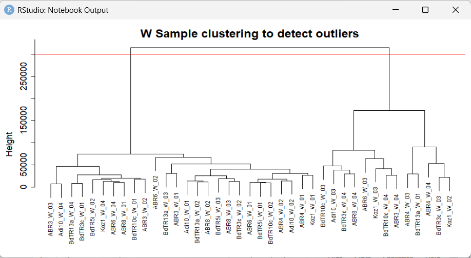
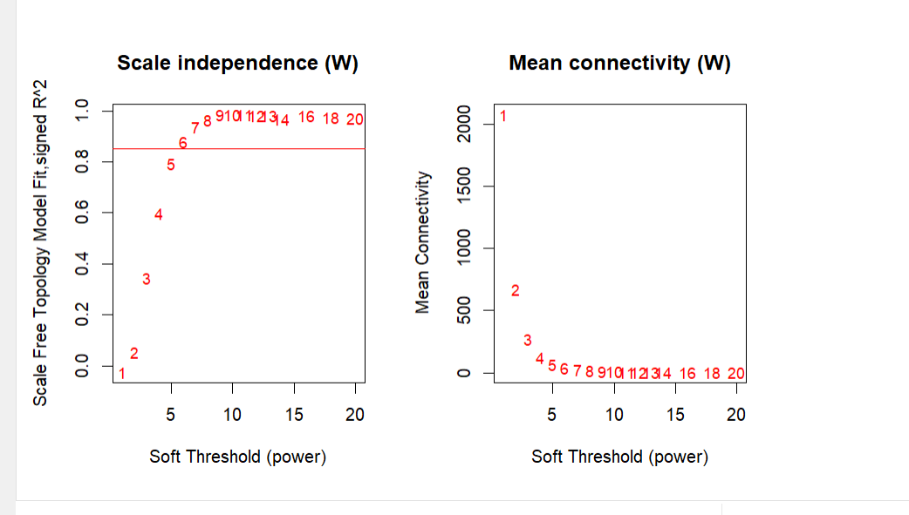
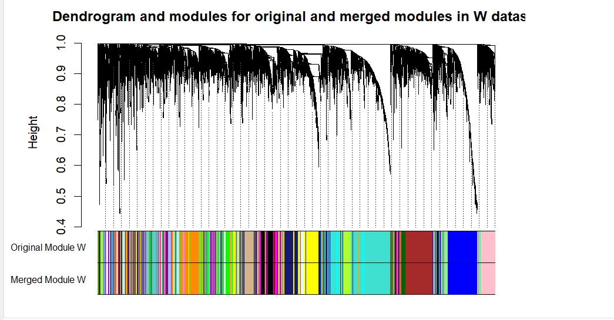

# Session 3_Analysis of transcriptomes (W dataset)

<details>
<summary><strong>🔴 Gene/isoform co-expression network construction and module identification in watered (W) RNA-seq samples using WGCNA</strong></summary>

## Question

**Construct a gene/isoform co-expression network using RNA-seq expression data from watered (W) samples and identify co-expression modules using WGCNA.**

---

## Workflow summary 

The analysis was performed using RNA-seq expression data from watered (W) samples following the WGCNA framework.  
The terminal (Docker/WSL) was used only for environment setup and data organisation, while all network analyses were carried out in **RStudio**.

The workflow can be divided into three main stages.

---

### 1) RNA-seq expression data preparation (W dataset)

**Where:** RStudio (Docker container, `/data/05_WGCNA`)  
**Input file:** `TPM_counts_Drought_W_dataset.csv`

The RNA-seq expression matrix (TPM values) was loaded and reformatted to meet WGCNA requirements, with samples in rows and isoforms in columns.

```
W_dataset <- read.csv("TPM_counts_Drought_W_dataset.csv")
datExprW  <- as.data.frame(t(W_dataset[, -1]))
colnames(datExprW) <- W_dataset$target_id
rownames(datExprW) <- colnames(W_dataset)[-1]
```
Quality control was applied to remove genes or samples with excessive missing values.
Outlier samples were identified using hierarchical clustering, and only samples belonging to the main cluster were retained.
The filtered expression matrix was saved for downstream analyses.

**Generated files:**
```
datExpr_W.RData
Sample clustering dendrogram 
```


### 2) Construction of the gene/isoform co-expression network

**Where:** RStudio

**Method:** WGCNA adjacency and TOM calculation


An appropriate soft-thresholding power was selected based on the scale-free topology criterion.
Using the selected power, a weighted gene/isoform co-expression network was constructed.

```
sftW <- pickSoftThreshold(datExprW, powerVector = powers, networkType = "unsigned")
adjacency_W <- adjacency(datExprW, power = 6)
TOM_W <- TOMsimilarity(adjacency_W)
TOM_diss_W <- 1 - TOM_W
```
Genes/isoforms were hierarchically clustered using TOM-based dissimilarity, generating a network-driven gene dendrogram.

**Generated files:**

```
Power selection plots
Gene dendrogram based on TOM dissimilarity

```



### 3) Identification of co-expression modules

**Where:** RStudio
**Method:** Dynamic tree cut and module merging

Co-expression modules were identified from the gene dendrogram using dynamic tree cutting and labelled using module colours.
Module eigengenes were calculated, and highly similar modules were merged to obtain the final set of co-expression modules.

```
modules_W <- cutreeDynamic(
  dendro = geneTree_W,
  distM = TOM_diss_W,
  deepSplit = 2,
  minClusterSize = 30
)
modulecolors_W <- labels2colors(modules_W)

merge_W <- mergeCloseModules(datExprW, modulecolors_W, cutHeight = 0.25)
modulecolors_W <- merge_W$colors

```
The final network structure and module information were saved for downstream analyses.

**Generated files:**
```
net_W.RData
Module dendrograms (before and after merging)
Genes_per_module_W.tsv
```


## References
- CIHEAM Zaragoza bioinformatics materials: https://eead-csic-compbio.github.io/bioinformatics  
- Practical WGCNA script: https://github.com/eead-csic-compbio/bioinformatics/blob/main/coexp/Practical_WGCNA_W_dataset.Rmd
- OpenAI ChatGPT – used for language refinement and clarification  
of BLAST output redirection during Session 3


</details>
