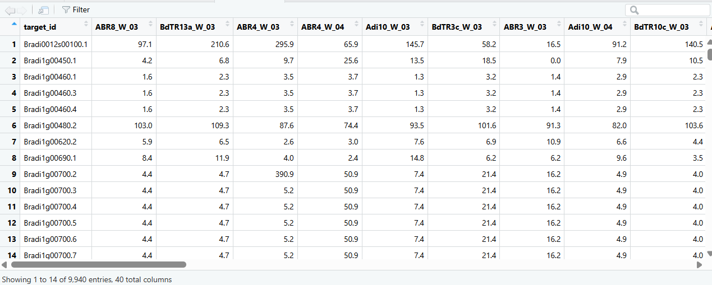

# Session 3_Analysis of transcriptomes (W dataset)

<details>
<summary><strong>🔴 Gene/isoform co-expression network construction and module identification in watered (W) RNA-seq samples using WGCNA</strong></summary>

## Question

**Construct a gene/isoform co-expression network using RNA-seq expression data from watered (W) samples and identify co-expression modules using WGCNA.**

---

## Workflow summary 

The analysis was performed using RNA-seq expression data from watered (W) samples following the WGCNA framework.  
The terminal (Docker/WSL) was used only for environment setup and data organisation, while all network analyses were carried out in **RStudio**.

The workflow can be divided into **three main stages**.

---

### 1) RNA-seq expression data preparation (W dataset)

**Where:** RStudio (Docker container, `/data/05_WGCNA`)  
**Input file:** `TPM_counts_Drought_W_dataset.csv`

The RNA-seq expression matrix (TPM values) was loaded and reformatted to meet WGCNA requirements, with samples in rows and isoforms in columns.

```
W_dataset <- read.csv("TPM_counts_Drought_W_dataset.csv")
datExprW  <- as.data.frame(t(W_dataset[, -1]))
colnames(datExprW) <- W_dataset$target_id
rownames(datExprW) <- colnames(W_dataset)[-1]
```
Quality control was applied to remove genes or samples with excessive missing values.
Outlier samples were identified using hierarchical clustering, and only samples belonging to the main cluster were retained.
The filtered expression matrix was saved for downstream analyses.

**Generated files:**
```
- Filtered expression matrix (`datExpr_W.RData`)
- Sample clustering dendrogram
```


### 2) Construction of the gene/isoform co-expression network

**Where:** RStudio

First, different soft-thresholding (power) values were tested using the `pickSoftThreshold()` function in order to approximate the scale-free topology assumption of WGCNA. 
The goal was to select the lowest power value for which the “Scale independence (signed R²)” exceeded the predefined threshold (horizontal line at 0.85 in the plot). 
Based on this criterion, **power = 6** was selected.

Using this power value, correlation-based similarities between genes/isoforms were transformed into weighted network connections (adjacency). To obtain a more robust representation of network structure, the Topological Overlap Matrix (TOM) was calculated; TOM-based dissimilarity was subsequently used for module detection.

```
sftW <- pickSoftThreshold(datExprW, powerVector = powers, networkType = "unsigned")
adjacency_W <- adjacency(datExprW, power = 6)
TOM_W <- TOMsimilarity(adjacency_W)
TOM_diss_W <- 1 - TOM_W
```


### 3) Identification of co-expression modules

**Where:** RStudio

Genes/isoforms were hierarchically clustered based on TOM dissimilarity, and co-expression modules were identified using the dynamic tree cut algorithm. 
Module eigengenes were calculated, and highly similar modules were merged to obtain the final set of co-expression modules.

The resulting gene dendrogram together with module colour assignment (before and after merging) is shown below.

```
modules_W <- cutreeDynamic(
  dendro = geneTree_W,
  distM = TOM_diss_W,
  deepSplit = 2,
  minClusterSize = 30
)
modulecolors_W <- labels2colors(modules_W)

merge_W <- mergeCloseModules(datExprW, modulecolors_W, cutHeight = 0.25)
modulecolors_W <- merge_W$colors

```
The final network structure and module information were saved for downstream analyses.

**Generated files:**
```
- Network and module data (`net_W.RData`)
- Module dendrograms before and after merging
- Gene lists per module (`Genes_per_module_W.tsv`)
```


## References
- CIHEAM Zaragoza bioinformatics materials: https://eead-csic-compbio.github.io/bioinformatics  
- Practical WGCNA script: https://github.com/eead-csic-compbio/bioinformatics/blob/main/coexp/Practical_WGCNA_W_dataset.Rmd
- OpenAI ChatGPT – used for language refinement and clarification  
of BLAST output redirection during Session 3


</details>


<details>
<summary><strong>🔴 Exercise 3.1 – Number of samples and isoforms in the W RNA-seq dataset</strong></summary>

## Question: 
**How many samples and isoforms are included in `TPM_counts_Drought_W_dataset.csv`?**

**Answer:**  
The file `TPM_counts_Drought_W_dataset.csv` contains **9,940 isoforms** and **39 watered (W) samples**.

This information was obtained by inspecting the dimensions of the expression matrix after loading it into R. The dataset has 9,940 rows corresponding to isoforms and 40 columns in total, where the first column (`target_id`) contains isoform identifiers and the remaining 39 columns correspond to RNA-seq samples.

**Evidence (R output):**

```
dim(W_dataset)
[1] 9940 40
```



</details>


