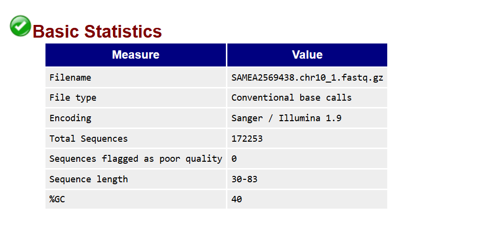
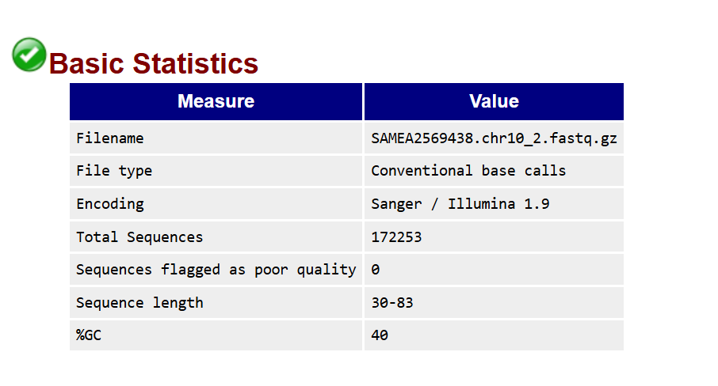
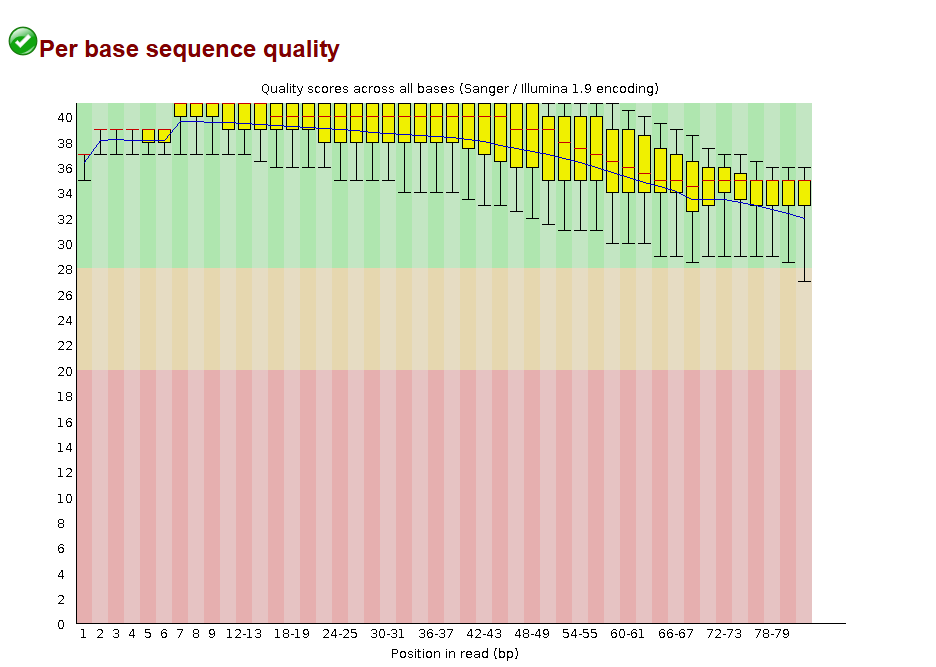
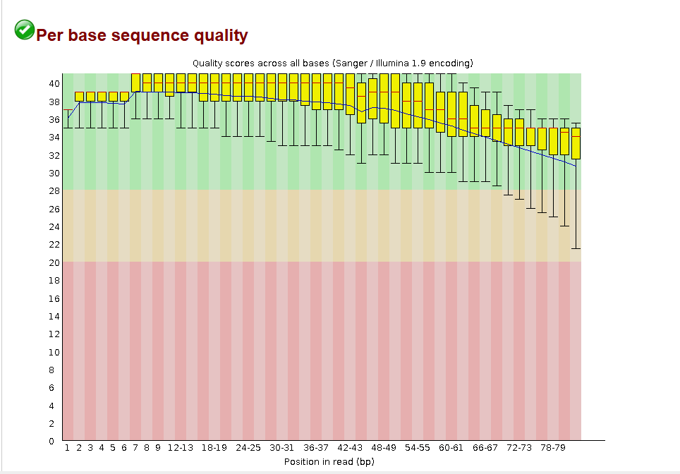
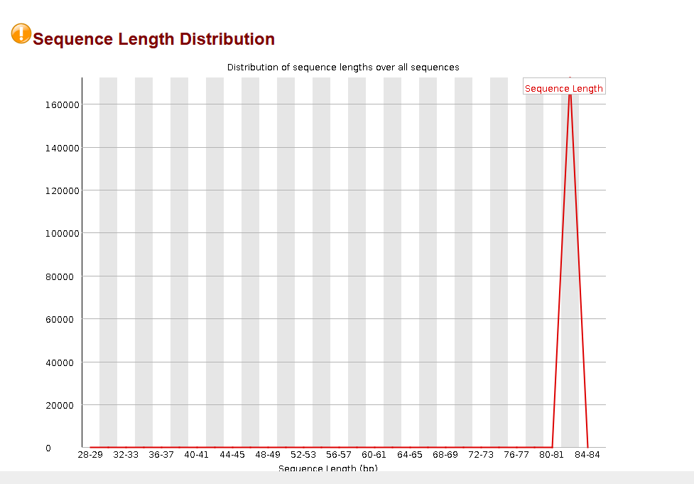
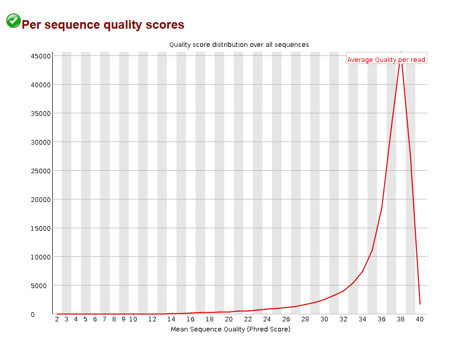
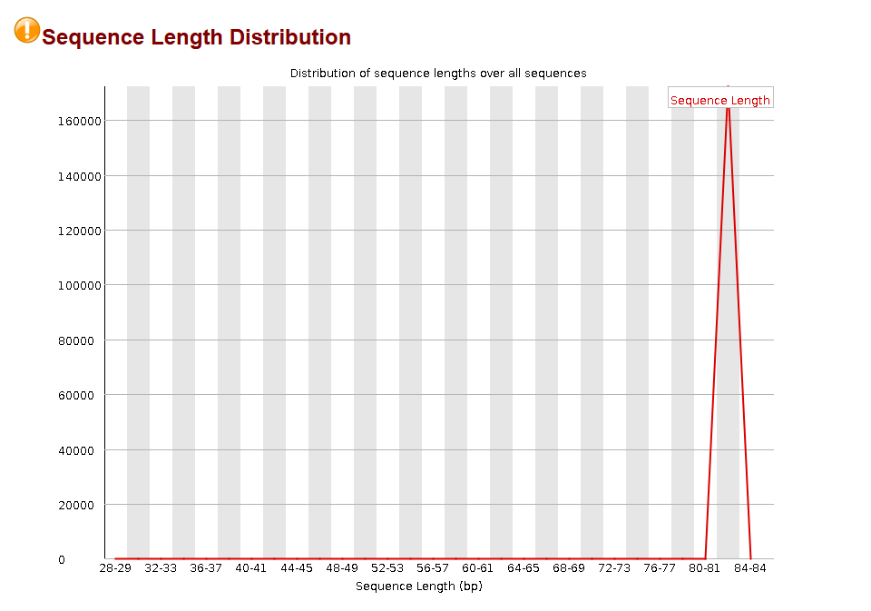

# Session 5 – Mapping, variant calling and variant filtering

<details>
<summary><strong>🔴 Exercise 1</strong></summary>

---

<details>
<summary><strong>Exercise 1.1 – Why are there two FASTQ files?</strong></summary>

### Question
Why are there two FASTQ files with the same name but different numeric suffixes?

### Answer
The two FASTQ files indicate **paired-end sequencing**.

- `SAMEA2569438.chr10_1.fastq.gz` contains **Read 1 (forward reads)**
- `SAMEA2569438.chr10_2.fastq.gz` contains **Read 2 (reverse reads)**

Each DNA fragment was sequenced from both ends, generating two corresponding reads.

</details>

---

<details>
<summary><strong>Exercise 1.2 – FASTQ format and differences between Read 1 and Read 2</strong></summary>

### Question
What are the differences between the two FASTQ files?  
Do they follow the typical FASTQ format?

### Answer
Both files follow the **standard FASTQ format** and show very similar characteristics:

- Same number of reads (**172,253**)
- Same GC content (**40%**)
- Similar read length distribution (**30–83 bp**)
- Same encoding (**Sanger / Illumina 1.9**)

The only difference is the **read orientation** (forward vs reverse).

**Read 1 – Basic statistics:**  


**Read 2 – Basic statistics:**  


</details>

---

<details>
<summary><strong>Exercise 1.3 – Sequencing error rate along reads</strong></summary>

### Question
Are read starts and read ends similar in terms of error rate?

### Answer
No. Sequencing quality is **higher at the beginning of reads** and **decreases toward the read ends**.

This pattern is observed in both Read 1 and Read 2 and is typical for Illumina sequencing data.

**Per-base quality – Read 1:**  


**Per-base quality – Read 2:**  


</details>

---

### Additional quality metrics

**Per-sequence quality scores – Read 1:**  


**Read length distribution – Read 1:**  


**Per-sequence quality scores – Read 2:**  


**Read length distribution – Read 2:**  



---

### Interpretation

The FASTQ files correspond to high-quality paired-end Illumina sequencing data.  
The observed quality decay toward read ends is expected and does not compromise downstream mapping and variant calling.

### References

FastQC Documentation – Quality control for high throughput sequence data
https://www.bioinformatics.babraham.ac.uk/projects/fastqc/

Illumina Sequencing Technology – Sequencing by synthesis overview
https://www.illumina.com/science/technology/next-generation-sequencing/sequencing-technology.html

OpenAI ChatGPT – used for language refinement and conceptual clarification of FASTQ format and FastQC quality assessment
Prompt-based assistance during Session 5, Exercise 1

</details>


<details>
<summary><strong>🔴 Exercise 2</strong></summary>

## Question

**Compare the different file sizes for each of the alignment files generated in the previous section (SAM, BAM and CRAM formats).**

---

## Commands used

```bash
# SAM output 
bwa mem reference.fna reads_1.fastq.gz reads_2.fastq.gz

# BAM generation
bwa mem reference.fna reads_1.fastq.gz reads_2.fastq.gz | \
samtools view -b -o SAMEA2569438.chr10.bam

# CRAM generation
bwa mem reference.fna reads_1.fastq.gz reads_2.fastq.gz | \
samtools view -C -T reference.fna > SAMEA2569438.chr10.cram

# File size comparison
ls -lh SAMEA2569438.chr10.*
```
## Results

The same alignment was stored using different formats, resulting in different file sizes:

BAM: ~32 MB

CRAM: ~13 MB

(SAM was generated by bwa mem as text output but was not stored as a file.)

Observed size relationship:
**SAM > BAM > CRAM**


## Interpretation

SAM is a plain-text format and therefore requires the largest storage space.
BAM is a binary and compressed version of SAM, leading to a significant reduction in file size.
CRAM uses reference-based compression and achieves the highest compression efficiency.

CRAM is the most storage-efficient format for long-term storage, provided that the reference genome is available.

## References

HTSlib SAM/BAM/CRAM format specification
https://samtools.github.io/hts-specs/

OpenAI ChatGPT – used for language refinement and conceptual clarification
Prompt-based assistance during Session 5, Exercise 2

</details>


