# Session 5 – Mapping, variant calling and variant filtering

<details>
<summary><strong>🔴 Exercise 1</strong></summary>

---

<details>
<summary><strong>Exercise 1.1 – Why are there two FASTQ files?</strong></summary>

### Question
Why are there two FASTQ files with the same name but different numeric suffixes?

### Answer
The two FASTQ files indicate **paired-end sequencing**.

- `SAMEA2569438.chr10_1.fastq.gz` contains **Read 1 (forward reads)**
- `SAMEA2569438.chr10_2.fastq.gz` contains **Read 2 (reverse reads)**

Each DNA fragment was sequenced from both ends, generating two corresponding reads.

</details>

---

<details>
<summary><strong>Exercise 1.2 – FASTQ format and differences between Read 1 and Read 2</strong></summary>

### Question
What are the differences between the two FASTQ files?  
Do they follow the typical FASTQ format?

### Answer
Both files follow the **standard FASTQ format** and show very similar characteristics:

- Same number of reads (**172,253**)
- Same GC content (**40%**)
- Similar read length distribution (**30–83 bp**)
- Same encoding (**Sanger / Illumina 1.9**)

The only difference is the **read orientation** (forward vs reverse).

**Read 1 – Basic statistics:**  
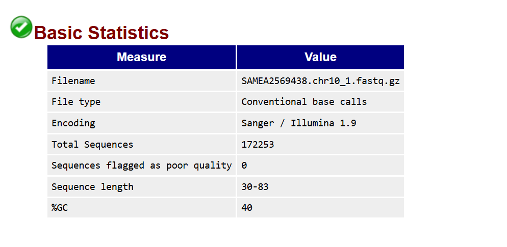

**Read 2 – Basic statistics:**  
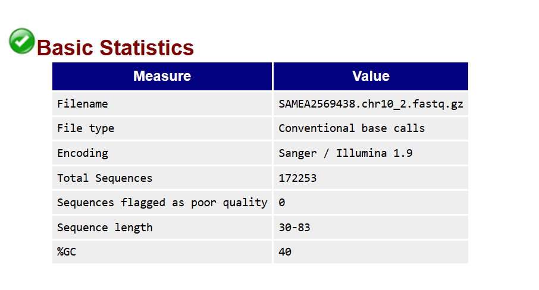

</details>

---

<details>
<summary><strong>Exercise 1.3 – Sequencing error rate along reads</strong></summary>

### Question
Are read starts and read ends similar in terms of error rate?

### Answer
No. Sequencing quality is **higher at the beginning of reads** and **decreases toward the read ends**.

This pattern is observed in both Read 1 and Read 2 and is typical for Illumina sequencing data.

**Per-base quality – Read 1:**  
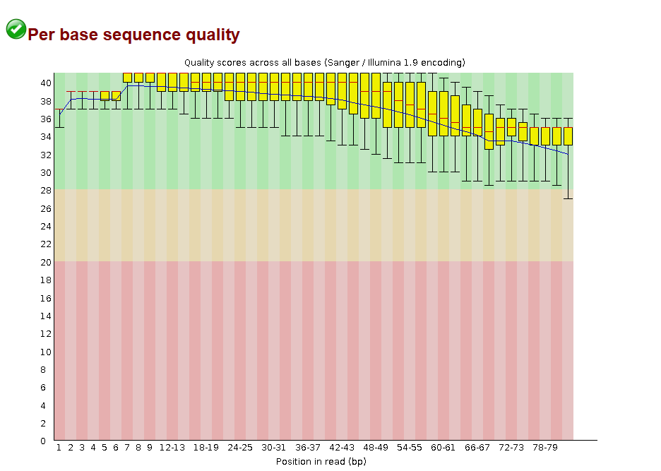

**Per-base quality – Read 2:**  
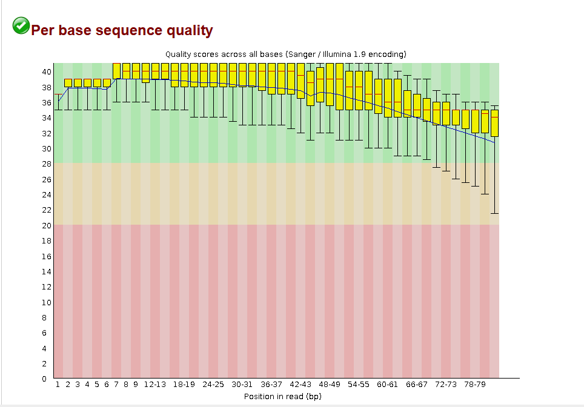

</details>

---

### Additional quality metrics

**Per-sequence quality scores – Read 1:**  
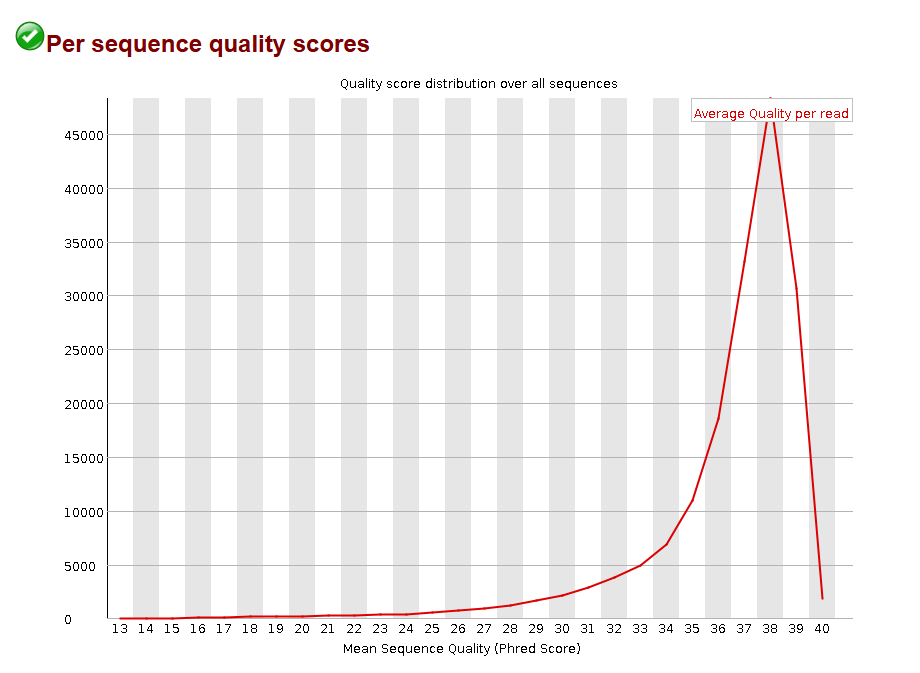

**Read length distribution – Read 1:**  
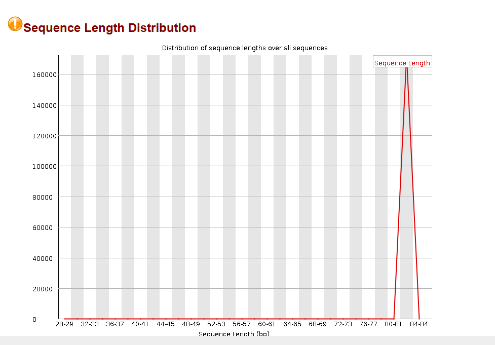

**Per-sequence quality scores – Read 2:**  
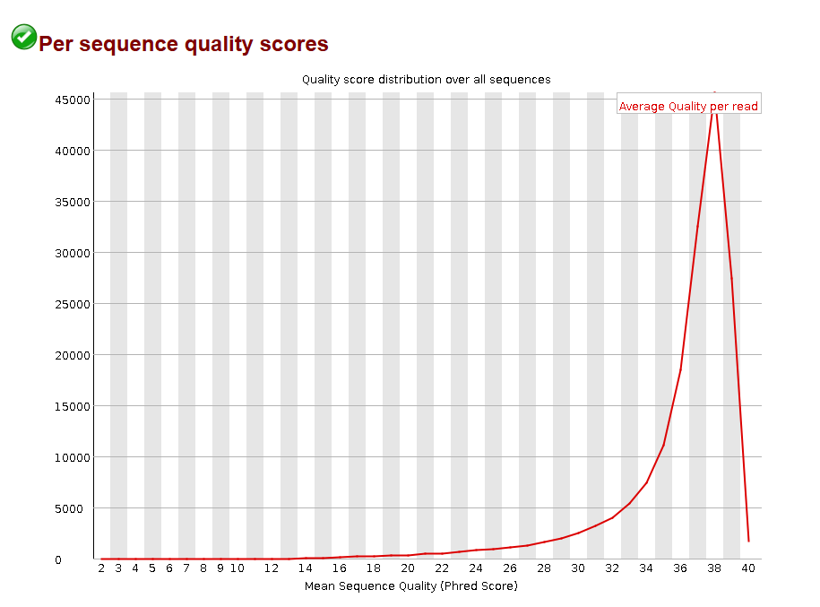

**Read length distribution – Read 2:**  
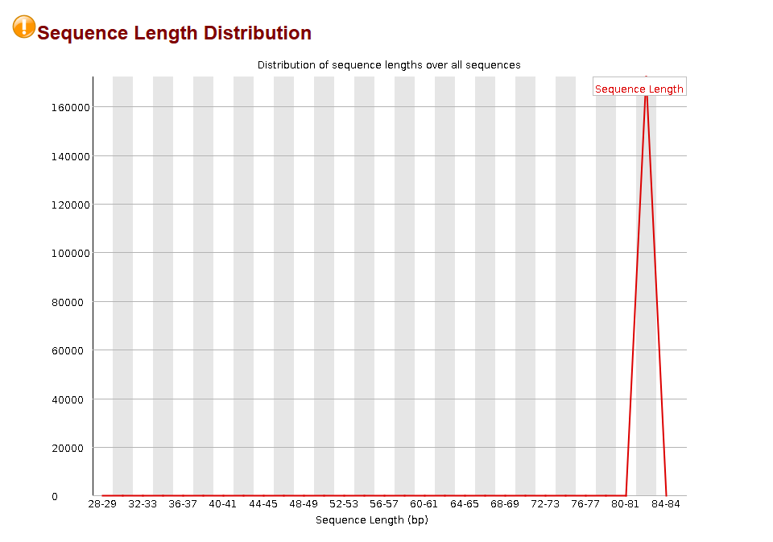


---

### Interpretation

The FASTQ files correspond to high-quality paired-end Illumina sequencing data.  
The observed quality decay toward read ends is expected and does not compromise downstream mapping and variant calling.

### References

Andrews, S. (2010).
FastQC: A Quality Control Tool for High Throughput Sequence Data.
https://www.bioinformatics.babraham.ac.uk/projects/fastqc/

Illumina, Inc.
FASTQ File Format and Quality Scores.
https://www.illumina.com/science/technology/next-generation-sequencing/plan-experiments/quality-scores.html

OpenAI ChatGPT – used for language refinement and conceptual clarification of FASTQ format, paired-end sequencing, and quality score interpretation
Prompt-based assistance during Session 5, Exercise 1

</details>


<details>
<summary><strong>🔴 Exercise 2</strong></summary>

## Question

**Compare the different file sizes for each of the alignment files generated in the previous section (SAM, BAM and CRAM formats).**

---

## Commands used

```bash
# SAM output 
bwa mem reference.fna reads_1.fastq.gz reads_2.fastq.gz

# BAM generation
bwa mem reference.fna reads_1.fastq.gz reads_2.fastq.gz | \
samtools view -b -o SAMEA2569438.chr10.bam

# CRAM generation
bwa mem reference.fna reads_1.fastq.gz reads_2.fastq.gz | \
samtools view -C -T reference.fna > SAMEA2569438.chr10.cram

# File size comparison
ls -lh SAMEA2569438.chr10.*
```
## Results

The same alignment was stored using different formats, resulting in different file sizes:

BAM: ~32 MB

CRAM: ~13 MB

(SAM was generated by bwa mem as text output but was not stored as a file.)

Observed size relationship:
**SAM > BAM > CRAM**


## Interpretation

SAM is a plain-text format and therefore requires the largest storage space.
BAM is a binary and compressed version of SAM, leading to a significant reduction in file size.
CRAM uses reference-based compression and achieves the highest compression efficiency.

CRAM is the most storage-efficient format for long-term storage, provided that the reference genome is available.

## References

HTSlib SAM/BAM/CRAM format specification
https://samtools.github.io/hts-specs/

OpenAI ChatGPT – used for language refinement and conceptual clarification
Prompt-based assistance during Session 5, Exercise 2

</details>

<details>
<summary><strong>🔴 Exercise 3</strong></summary>

## Question

**Using samtools mpileup estimate the percentage of chromosome 10 with sequencing depth > 100.**

---

## Objective

The aim of this exercise was to quantify sequencing depth along chromosome 10  
and to estimate the proportion of genomic positions covered by more than 100 reads.

---

## Commands used

```bash
# Move to the working directory
cd /mnt/d/backup_unit5/transcriptome_class

# Generate pileup file for chromosome 10
samtools mpileup -f reference.fna SAMEA2569438.chr10.sorted.bam > chr10.mpileup

# Count total number of positions
awk '{c++} END {print c}' chr10.mpileup

# Count positions with depth > 100
awk '$4 > 100 {c++} END {print c}' chr10.mpileup

# Calculate percentage of positions with depth > 100
awk '
{
  total++
  if ($4 > 100) high++
}
END {
  print (high/total)*100
}' chr10.mpileup
```

## Results

The pileup file contained per-base coverage information for chromosome 10.

**Total positions analysed: 3,991,887**

**Positions with depth > 100: 51,811**

**Percentage of positions with depth > 100: 1.30%**

## Interpretation

Only a small fraction of chromosome 10 shows very high sequencing depth (>100).
Such regions are typically associated with repetitive sequences, locally increased read mappability,
or technical amplification effects.

Estimating depth distribution is important to assess coverage uniformity
and to interpret the reliability of downstream variant calling.

## References

Samtools mpileup documentation
https://www.htslib.org/doc/samtools-mpileup.html

OpenAI ChatGPT – used for language refinement and explanation of depth estimation
Prompt-based assistance during Session 5, Exercise 3

</details> 

<details>
<summary><strong>🔴 Exercise 4</strong></summary>
  
---  
<details>
<summary><strong>Exercise 4.1 – Accessing the IGV-Web application</strong></summary>

## Question

**Outside Docker, open the URL https://igv.org/app in a browser and check the documentation.**

## Actions performed

The IGV-Web application documentation was accessed using a standard web browser by visiting:

https://igv.org/doc/webapp/

The main documentation sections describing IGV-Web, usage options, licensing, and citation information were reviewed.

## Result

The documentation confirms that IGV-Web is a browser-based version of the Integrative Genomics Viewer that allows interactive visualization of genomic data without requiring local installation.

IGV-Web supports loading local genomic files (e.g. FASTA, BAM, VCF, GTF) directly in the browser, and all data remain on the user’s local machine.

## Evidence

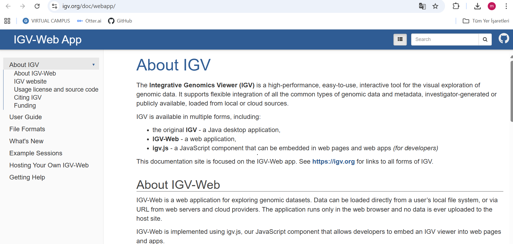

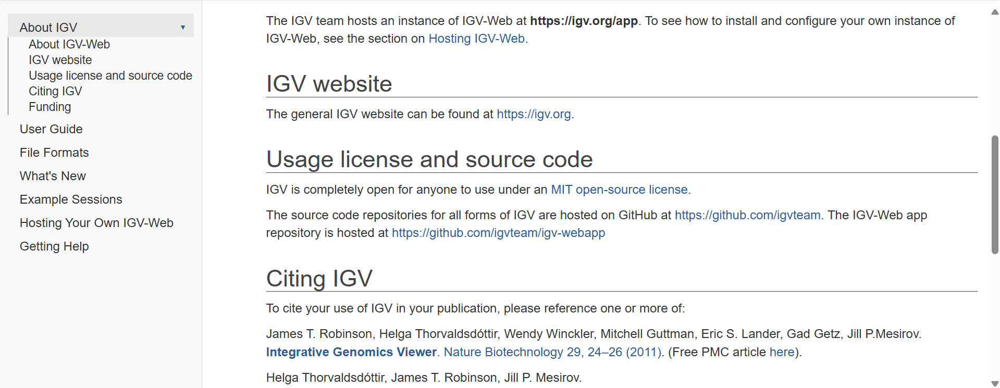

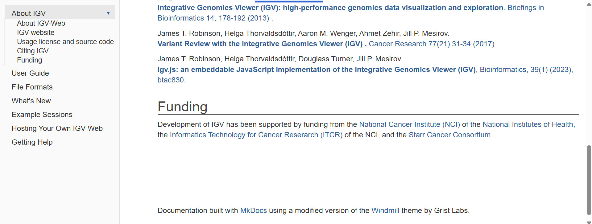

</details>

---

<details>
<summary><strong>Exercise 4.2 – Loading the reference genome in IGV</strong></summary>

## Question

**Load the reference FASTA and index files with the Genome → Local File option.**

---

## Procedure

The reference genome was loaded into IGV using the **Genome → Local File** option.
Both the FASTA file and its index were selected simultaneously:

- `reference.fna`
- `reference.fna.fai`

Loading both files allows IGV to correctly recognize chromosome names and genomic coordinates.

---

## Result

After loading the reference genome, chromosome-level navigation became available in IGV.
Chromosome 10 could be selected, and the genomic coordinate range  
`chr10:1–23,207,287` was displayed, confirming that the reference genome was successfully loaded.

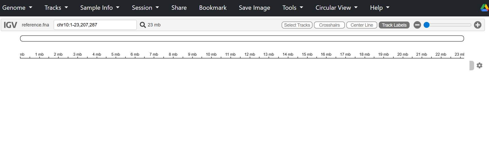

---

## Interpretation

This step establishes the genomic coordinate system required for downstream visualization.
No read alignments or annotations are displayed at this stage; those are loaded in subsequent steps.

</details>

---

<details>
<summary><strong>Exercise 4.3 – Loading gene annotation (GTF)</strong></summary>

## Question

**Load the gene annotation GTF file with the Tracks → Local File option.**

---

## Action performed

The gene annotation file (`annotation.gtf`) was loaded into IGV using the  
**Tracks → Local File** option.

The annotation track was displayed across chromosome 10, showing gene models
distributed along the reference genome. Gene structures are represented as
blocks and connecting lines, corresponding to exons and introns.

---

## Evidence

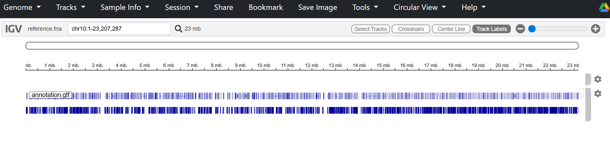

---

## Interpretation

The successful visualization of the `annotation.gtf` track confirms that the
gene annotation file is compatible with the loaded reference genome
(`reference.fna`). This allows genomic features such as genes, exons, and
transcript structures to be interpreted in the context of read alignments and
variant positions in subsequent steps.

</details>

---

<details>
<summary><strong>Exercise 4.4 – Loading BAM alignments in IGV</strong></summary>

## Question

**Load the BAM and index files with sorted, mapped reads using the Tracks → Local File option.**

---

## Procedure

The sorted BAM file containing mapped sequencing reads and its corresponding index file were loaded into IGV using the **Tracks → Local File** option.

The following files were selected simultaneously:
- `SAMEA2569438.chr10.sorted.bam`
- `SAMEA2569438.chr10.sorted.bam.bai`

---

## Results

After loading the BAM and BAI files, IGV displayed a coverage track for chromosome 10 together with the aligned reads track.
At this zoom level, individual reads are not yet visible and IGV indicates that further zooming is required to inspect alignment details.

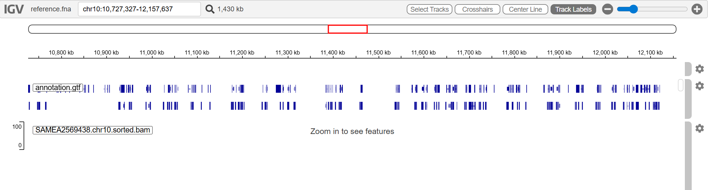

---

## Interpretation

The BAM file stores mapped sequencing reads in a compressed binary format, while the BAI index enables rapid access to specific genomic regions.
Together, these files allow efficient visualization of read coverage and alignments in IGV, which can be explored in more detail by zooming into specific loci.

</details>

---

<details>
<summary><strong>Exercise 4.5 – Visualization of mapped reads in a specific genomic region</strong></summary>

## Question

**Go to the chr location 10:9,768,000–9,784,000 and zoom in to display the reads.**

---

## Procedure

Using the IGV web application, the genomic coordinates  
`chr10:9,768,000–9,784,000` were entered into the search bar.

The view was zoomed in until individual aligned reads became visible.
At this resolution, both the gene annotation track and the aligned sequencing
reads could be clearly observed.

---

## Results

At the selected genomic region, the following elements are visible:

- Gene models from the **annotation.gtf** track, including exons and introns.
- A dense coverage of aligned reads from the **SAMEA2569438.chr10.sorted.bam** file.
- Mismatches between reads and the reference sequence, displayed as colored bases.
- Local variation in read depth across the region.

These observations confirm that the BAM file was correctly loaded and that the
reads are properly mapped to chromosome 10.

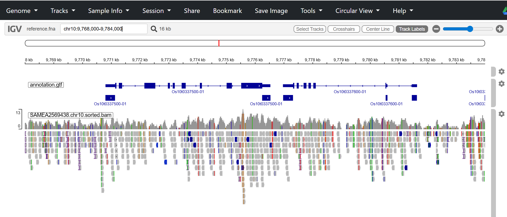

---

## Interpretation

Zooming into a specific genomic interval allows direct visual inspection of
read alignment quality, coverage depth, and potential sequence variation.
The presence of consistent read coverage and correctly aligned reads across
annotated genes indicates successful mapping and data integrity.

---

</details>


### References

OpenAI ChatGPT – used for language refinement and report structuring  
Prompt-based assistance during Session 5, Exercise 4

</details>

<details>
<summary><strong>🔴 Exercise 5</strong></summary>
  
---  

<details>
<summary><strong>Exercise 5.1 – Opening IGV Web App</strong></summary>

## Question

**Outside Docker, open the URL https://igv.org/app in a browser.**

---
## Answer

The IGV web application was successfully accessed using a standard web browser outside the Docker environment.

This confirms that IGV-Web can be used directly without Docker to visualize genomic data stored on the local or WSL-accessible file system.

---

## Evidence

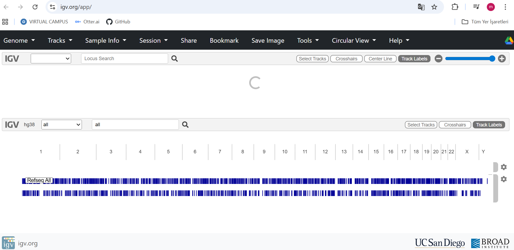

</details>

---

<details>
<summary><strong>Exercise 5.2 – Loading the reference genome in IGV</strong></summary>

## Question

**Load the reference FASTA and index files with the Genome → Local File option.**

---

## Procedure

The reference genome was loaded into IGV using the **Genome → Local File** option.
Both the FASTA file and its index were selected simultaneously:

- `reference.fna`
- `reference.fna.fai`

Loading both files allows IGV to correctly recognize chromosome names and genomic coordinates.

---

## Result

After loading the reference genome, chromosome-level navigation became available in IGV.
Chromosome 10 could be selected, and the genomic coordinate range  
`chr10:1–23,207,287` was displayed, confirming that the reference genome was successfully loaded.


---

## Interpretation

This step establishes the genomic coordinate system required for downstream visualization.
No read alignments or annotations are displayed at this stage; those are loaded in subsequent steps.

</details>

---

<details>
<summary><strong>Exercise 5.3 – Loading gene annotation (GTF)</strong></summary>

## Question

**Load the gene annotation GTF file with the Tracks → Local File option.**

---

## Action performed

The gene annotation file (`annotation.gtf`) was loaded into IGV using the  
**Tracks → Local File** option.

The annotation track was displayed across chromosome 10, showing gene models
distributed along the reference genome. Gene structures are represented as
blocks and connecting lines, corresponding to exons and introns.

---

## Evidence


---

## Interpretation

The successful visualization of the `annotation.gtf` track confirms that the
gene annotation file is compatible with the loaded reference genome
(`reference.fna`). This allows genomic features such as genes, exons, and
transcript structures to be interpreted in the context of read alignments and
variant positions in subsequent steps.

</details>

---

<details>
<summary><strong>Exercise 5.4 – Loading filtered variants into IGV</strong></summary>

## Question

**Load the filtered VCF file with the variants using the Tracks → Local File option.**

---

## Procedure

The filtered variant file generated in the previous steps was loaded into the IGV Web App.

Using the top menu in IGV, the following option was selected:

**Tracks → Local File**

The filtered VCF file containing the variants was loaded:

- `SAMEA2569438.chr10.filt.vcf.gz`

The corresponding index file (`.csi`) was automatically recognized by IGV.

---

## Results

After loading the filtered VCF file, variant tracks became visible along chromosome 10.
Both SNPs and INDELs are displayed as colored markers, allowing visual inspection of variant density and distribution across the chromosome.

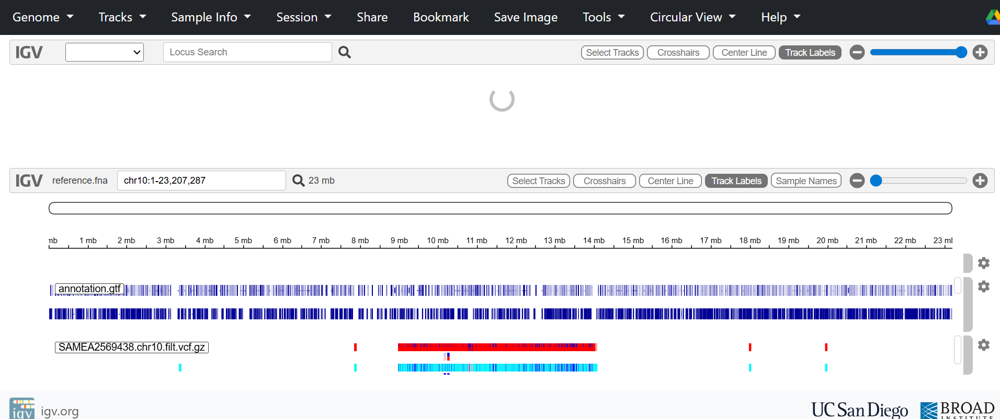

---

## Interpretation

The successful visualization of the filtered VCF confirms that variant calling and filtering were performed correctly.
IGV allows direct inspection of variant positions and facilitates downstream analysis, such as examining read support, genotype status, and overlap with gene models.

</details>

---

<details>
<summary><strong>Exercise 5.5 – Inspection of an INDEL variant in IGV</strong></summary>

## Question

**Inspect the INDEL variant at chr10:9,058,200–9,058,229.  
What are the reference (REF) and alternative (ALT) alleles?  
Is this position heterozygous in the mapped sample?**

---

## Method

The filtered variant file (`SAMEA2569438.chr10.filt.vcf.gz`) and the sorted BAM file
(`SAMEA2569438.chr10.sorted.bam`) were loaded into the IGV Web App.

The genomic region **chr10:9,058,200–9,058,229** was zoomed in to base-level
resolution, and the VCF and BAM tracks were examined together.

---

## Results

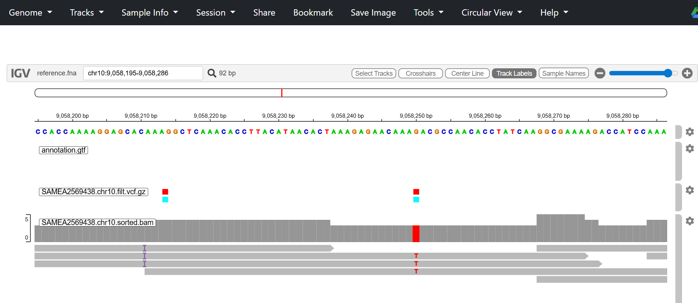

- **Reference allele (REF):** C  
- **Alternative allele (ALT):** T  

In the BAM track, reads supporting both the reference and the alternative allele were observed at the same genomic position. 

---

## Interpretation

In the IGV view, the base at this position in the **reference genome** is shown as **C**. In the BAM track, some reads at the same position are observed to carry the **T** base, displayed in red.

The presence of reads supporting both the reference and the alternative allele at the same locus indicates that this INDEL variant is **heterozygous**.

This conclusion is based solely on the visual inspection of read alignments in IGV.

</details>

---

## References

OpenAI ChatGPT – used for language refinement and report structuring  
Prompt-based assistance during Session 5, Exercise 5

